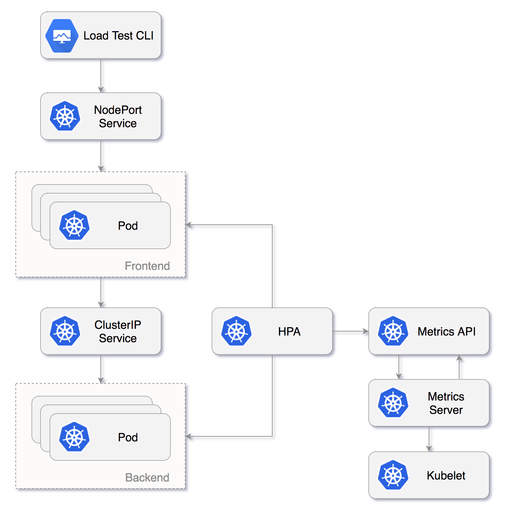

# Auto-scaling guide 



### Deploy Frontend and Backend services

Create a release named frontend:

```bash
helm upgrade --install --wait frontend \
    --set replicaCount=2 \
    --set service.type=NodePort \
    --set service.nodePort=30098 \
    --namespace test \
    ./chart/stable/podinfo
```

Setup horizontal pod auto-scaling (HPA) based on memory consumption:

```bash
helm upgrade --reuse-values frontend \
    --set hpa.enabled=true \
    --set hpa.maxReplicas=5 \
    --set hpa.memory=200Mi \
    ./chart/stable/podinfo
```

Create a release named backend:

```bash
helm upgrade --install --wait backend \
    --set replicaCount=1 \
    --set service.type=ClusterIP \
    --namespace test \
    ./chart/stable/podinfo
```

Setup HPA based on CPU usage:

```bash
helm upgrade --reuse-values backend \
    --set hpa.enabled=true \
    --set hpa.maxReplicas=10 \
    --set hpa.cpu=10 \
    ./chart/stable/podinfo
```

Check if the backend ClusterIP service is accessible from within the cluster:

```bash
helm test --cleanup backend
```

Wait for HPA to start receiving metrics:

```bash
kubectl -n test get hpa
```

Run load test:

```bash
#install hey
go get -u github.com/rakyll/hey

#do 10K requests rate limited at 100 QPS
hey -n 1000 -q 10 -c 10 -m POST -d "testing" http://<EXTERNAL-IP>:30098/backend
```

Delete the releases:

```bash
helm delete --purge frontend backend
```

