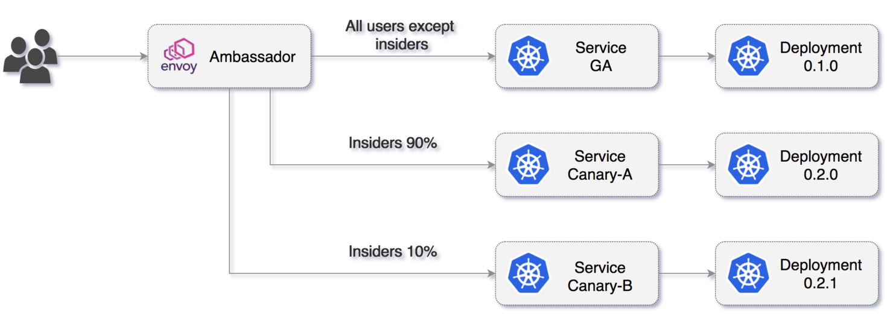
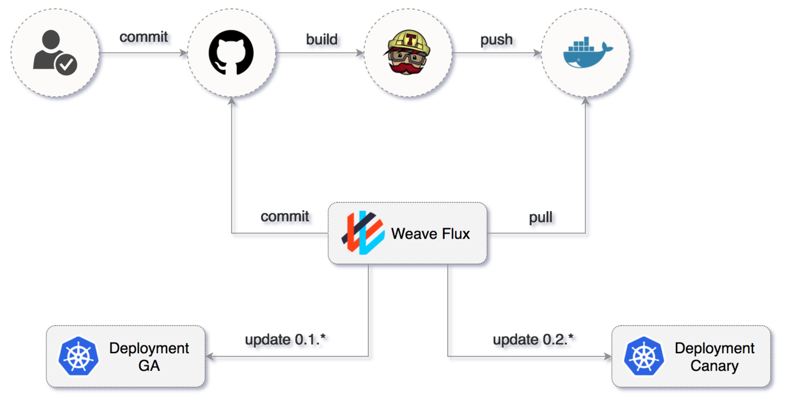
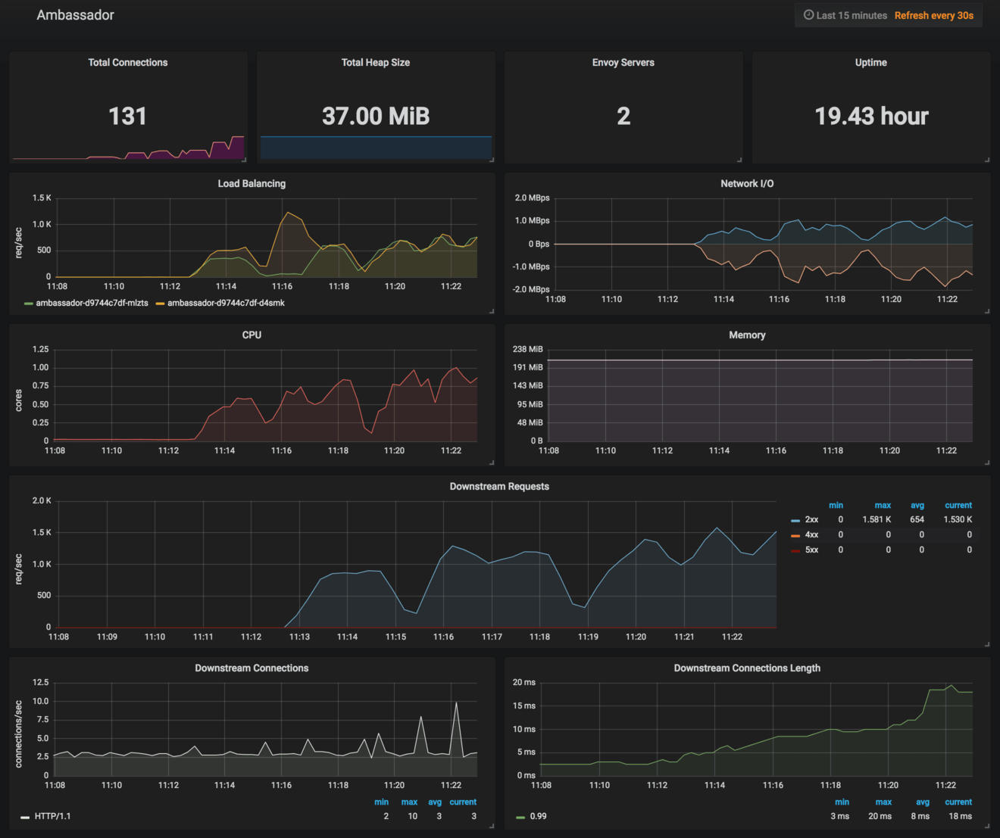

# Canary Deployments and A/B Testing

Canary Deployment and A/B testing with Ambassador's Envoy API Gateway. 



### Deploy Ambassador

Deploy Ambassador and expose it with a LoadBalancer service or NodePort if you are running on-prem:

```bash
helm repo add sp https://stefanprodan.github.io/k8s-podinfo

helm upgrade --install --wait envoy \
    --set service.type=LoadBalancer \
    --namespace default \
    sp/ambassador
```

Find the the LoadBalancer IP and store it in an environment variable for later use:

```bash
export ENVOY=$(kubectl get svc --namespace default envoy-ambassador -o jsonpath='{.status.loadBalancer.ingress[0].ip}')
```

Test that Envoy is listening on port 80:

```bash
curl -sI http://$ENVOY | grep envoy
server: envoy
``` 

### Expose services via the API gateway

Deploy podinfo version 0.1.0 as the general available release:

```yaml
kubectl apply -f ./deploy/canary/ga-dep.yaml
```

Expose the GA release via Ambassador on the `podinfo.test` domain:

```yaml
apiVersion: v1
kind: Service
metadata:
  name: ga-podinfo
  annotations:
    getambassador.io/config: |
      ---
      apiVersion: ambassador/v0
      kind: Mapping
      name: ga-podinfo
      prefix: /
      host: podinfo.test
      service: ga-podinfo.default:9898
spec:
  type: ClusterIP
  ports:
    - port: 9898
      targetPort: 9898
      protocol: TCP
  selector:
    app: ga-podinfo
```

Apply the GA service:

```bash
kubectl apply -f ./deploy/canary/ga-svc.yaml
```

Test that v0.1.0 is available at `podinfo.test` with curl:

```bash
curl -H 'Host: podinfo.test' -sS http://$ENVOY/version | grep version
version: 0.1.0
```

### Canary deployment

Let's assume you have an insiders program for your users and some of them enrolled.
Once enrolled your users requests will have a HTTP header like `X-User: insider` attached to every request.

Simulate an insider user call with:

```bash
curl -H 'X-User: insider' -H 'Host: podinfo.test' -sS http://$ENVOY/version | grep version
version: 0.1.0
```

Deploy podinfo version 0.2.0 as a release candidate:

```bash
kubectl apply -f ./deploy/canary/canarya-dep.yaml
```

Create a service named `canarya-podinfo` and instruct Ambassador to shift the insiders to the RC deployment:

```yaml
apiVersion: v1
kind: Service
metadata:
  name: canarya-podinfo
  annotations:
    getambassador.io/config: |
      ---
      apiVersion: ambassador/v0
      kind: Mapping
      name: canarya-podinfo
      prefix: /
      host: podinfo.test
      service: canarya-podinfo.default:9898
      headers:
        X-User: insider
spec:
  type: ClusterIP
  ports:
    - port: 9898
      targetPort: 9898
      protocol: TCP
  selector:
    app: canarya-podinfo
```

Apply the service with:

```bash
kubectl apply -f ./deploy/canary/canarya-svc.yaml
```

Now if a normal user calls podinfo nothing changed, 
but if an insider calls podinfo he/she will be routed to version 0.2.0:

```bash
curl -H 'Host: podinfo.test' -sS http://$ENVOY/version|grep version
version: 0.1.0

curl -H 'X-User: insider' -H 'Host: podinfo.test' -sS http://$ENVOY/version|grep version
version: 0.2.0
```

### A/B testing

Let's assume you have a new release candidate version that you want to test on a small subset of your 
insiders. 

Deploy podinfo version 0.2.1 as a release candidate:

```bash
kubectl apply -f ./deploy/canary/canaryb-dep.yaml
```

Create a service named `canaryb-podinfo` and instruct Ambassador to shift ten percent of
the insiders traffic to v0.2.1:

```yaml
apiVersion: v1
kind: Service
metadata:
  name: canaryb-podinfo
  annotations:
    getambassador.io/config: |
      ---
      apiVersion: ambassador/v0
      kind: Mapping
      name: canaryb-podinfo
      prefix: /
      host: podinfo.test
      service: canaryb-podinfo.default:9898
      weight: 10
      headers:
        X-User: insider
spec:
  type: ClusterIP
  ports:
    - port: 9898
      targetPort: 9898
      protocol: TCP
  selector:
    app: canaryb-podinfo
```

Apply the service with:

```bash
kubectl apply -f ./deploy/canary/canaryb-svc.yaml
```

Now let's call the service in a while loop, one in ten calls will be routed to v0.2.1:

```bash
while true; do sleep 1; curl -H 'X-User: insider' -H 'Host: podinfo.test' -sS http://$ENVOY/version|grep version; done
version: 0.2.0
version: 0.2.0
version: 0.2.0
version: 0.2.0
version: 0.2.0
version: 0.2.0
version: 0.2.0
version: 0.2.0
version: 0.2.0
version: 0.2.1
```

### CI/CD Automation

Once you have in place the GA and Canary releases you would probably want to automate 
the deployment of patches for 0.1.x and 0.2.x. 

Continuous delivery can be accomplished with a GitOps pipeline that involves several tools 
like TravisCI and Weave Flux.  



GA GitOps pipeline steps:

* An engineer cuts a new release by tagging the master branch as `0.1.1`
* GitHub notifies TravisCI that a new tag has been committed
* TravisCI builds the Docker image, tags it as `0.1.1` and pushes it to Docker Hub
* Weave Flux detects the new tag on Docker Hub and updates the GA deployment definition 
* Weave Flux commits the GA deployment definition to GitHub
* Weave Flux triggers a rolling update of the GA deployment 

The canary continuous delivery follows the same pattern, the only difference is that Weave Flux must be 
configured with a different filter:

* `0.1.*` for GA 
* `0.2.*` for Canary

### Monitoring

Install Grafana chart with Weave Cloud data source:

```bash
helm install --name weave \
 --set token=yghrfcs5berdqp68z7wfndcea93rq6nx \
 --set service.type=LoadBalancer \
 sp/grafana
```

Start a load test for both GA and Canary deployments:

```bash
hey -n 10000 -host podinfo.test http://$ENVOY
hey -n 10000 -host podinfo.test -H 'X-Client: insider' http://$ENVOY
```

Open Grafana's URL and navigate to Ambassador dashboard:



TODO: GA vs Canary RED metrics dashboard
