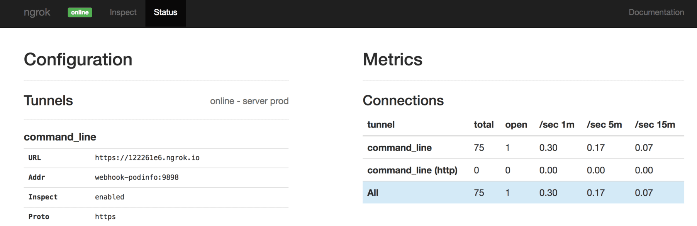
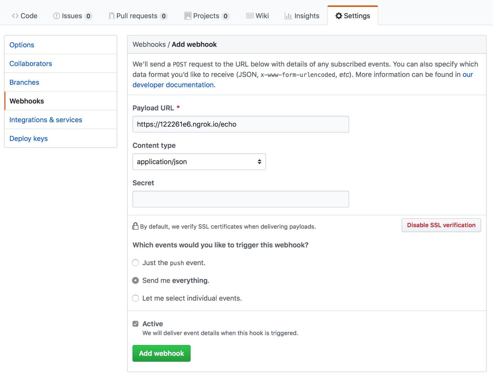
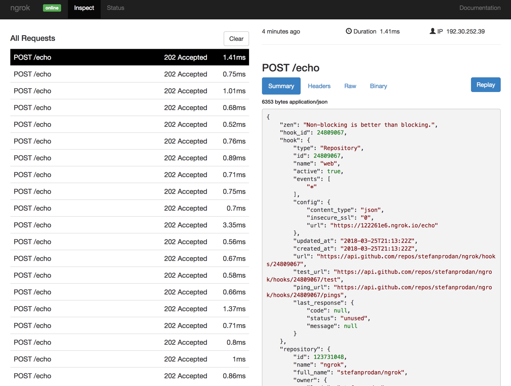

# Expose Kubernetes services over HTTPS with Ngrok

Have you ever wanted to expose a Kubernetes service running on Minikube on the internet and have a 
temporary HTTPS address for it? If so then Ngrok is the perfect solution to do that without any 
firewall, NAT or DNS configurations.
If you are developing an application that works with webhooks or oauth callbacks 
Ngrok can create a tunnel between your Kubernetes service and their cloud platform and provide you with 
a unique HTTPS URL that you can use to test and debug your service. 

For this purpose I've made a Helm chart that you can use to deploy Ngrok on Kubernetes by specifying 
a ClusterIP service that will get exposed on the internet.

What follows is a step-by-step guide on how you can use Ngrok as a reverse proxy to 
receive GitHub notifications via webhooks in an application hosted on your local Minikube. 

### Deploy podinfo demo app

In order to receive notifications from GitHub you need a web application that exposes a 
HTTP POST endpoint and accepts a JSON payload. [Podinfo](https://github.com/stefanprodan/k8s-podinfo) 
is tiny web app made with Go that can receive any kind of payload on the `/echo` route. 
Let's deploy podinfo using Helm. 

If you don't have Helm running on your Kubernetes cluster here how you can set it up.

First install Helm CLI:

```bash
brew install kubernetes-helm
```

Create a service account for Tiller:

```bash
kubectl -n kube-system create sa tiller
```

Create a cluster role binding for Tiller:

```bash
kubectl create clusterrolebinding tiller-cluster-rule \
    --clusterrole=cluster-admin \
    --serviceaccount=kube-system:tiller 
```

Deploy Tiller in kube-system namespace:

```bash
helm init --skip-refresh --upgrade --service-account tiller
```

The podinfo and ngrok charts are hosted on GitHub. Add the k8s-podinfo repo:

```bash
helm repo add sp https://stefanprodan.github.io/k8s-podinfo
```

Install podinfo:

```bash
helm install sp/podinfo --name webhook 
``` 

This will deploy `podinfo` in the default namespace and 
will create a ClusterIP service with the address `webhook-podinfo:9898`.

### Deploy Ngrok reverse proxy

Before you begin go to [ngrok.com](https://ngrok.com) and register for a free account. 

Ngrok will create a token for you, use it when installing Ngrok chart.

Install Ngrok:

```bash
$ helm install sp/ngrok --name tunnel \
  --set token=NGROK-TOKEN \
  --set service.type=NodePort \
  --set expose.service=webhook-podinfo:9898
``` 

The above command will deploy Ngrok and will expose the Ngrok web UI on a random node port.
Find the port with:

```bash
kubectl get --namespace default -o jsonpath="{.spec.ports[0].nodePort}" services tunnel-ngrok
```

Now open a browser and navigate to `http://<KUBE-IP>:<NGROK-PORT>/status`. On the status page you 
should see the public HTTPS address generated by Ngrok.

Use curl to test if you can reach podinfo `/echo` route:

```bash
curl -d '{"message": "testing ngrok"}' https://122261e6.ngrok.io/echo
```

On the status page you should see that the total number of connections has increased.



### Setup GitHub webhook

Go to GitHub and create a new repository or use one that you already have. 
On your repo page go to _Settings -> Webhooks -> Add Webhook_ and enter the Ngrok HTTPS URL adding 
`/echo` at the end:



For Content-type select _application/json_, check _Send me everything_ and click on _Add webhook_.

Once you hit the add button GitHub will make a call to the `/echo` URL. Using Ngrok web UI you can 
inspect the GitHub payload. Navigate to `http://<KUBE-IP>:<NGROK-PORT>/inspect/http` and you 
should see the request body:



Ngrok not only make it very easy to expose Kubernetes services on the internet 
but also gives a powerful tool to inspect the traffic to your applications. 


